# 随机选择食物系统 - 设计图

## 1. 系统架构图

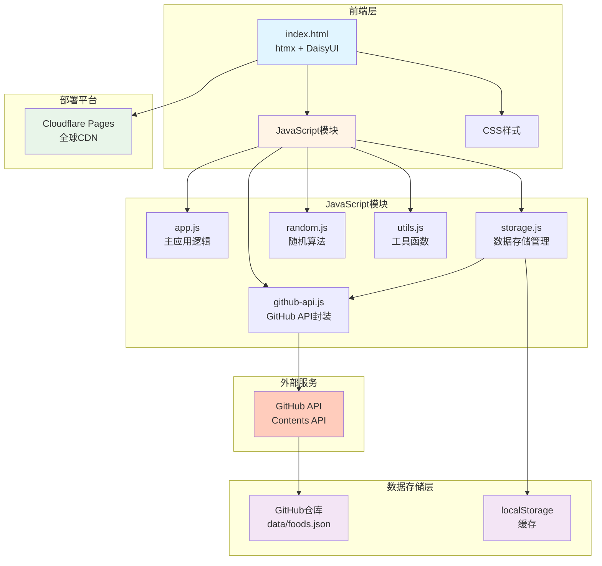

## 2. 数据流程图

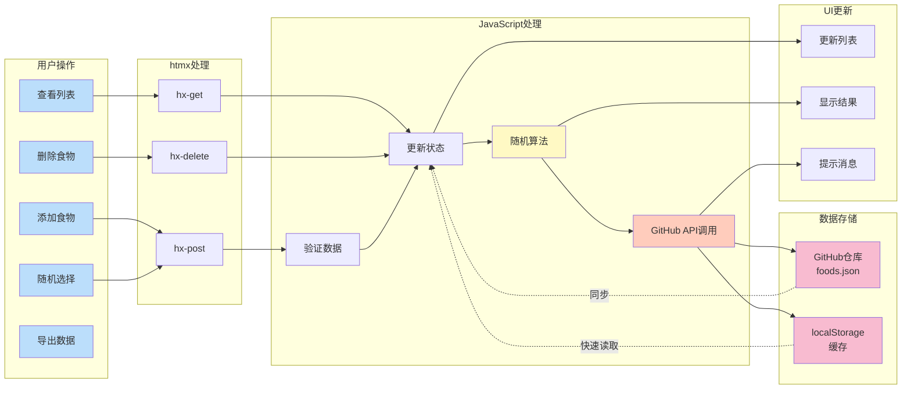

## 3. 页面结构图

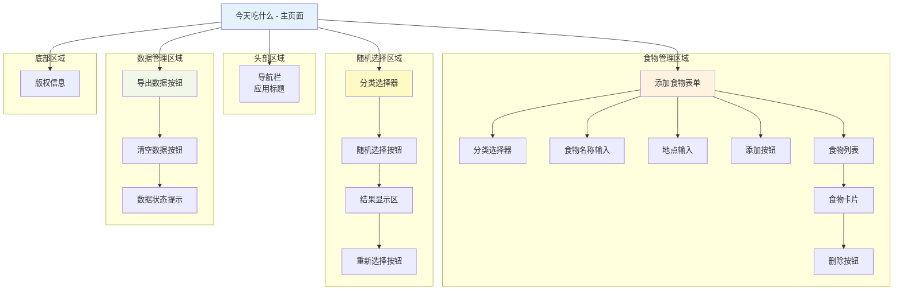

## 4. 数据模型关系图

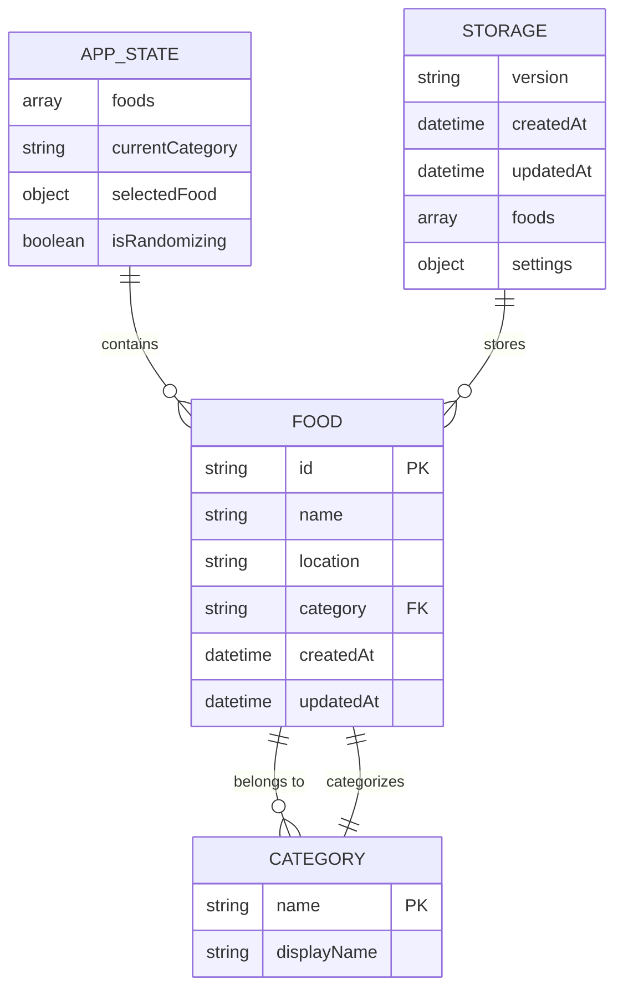

## 5. 用户交互流程图

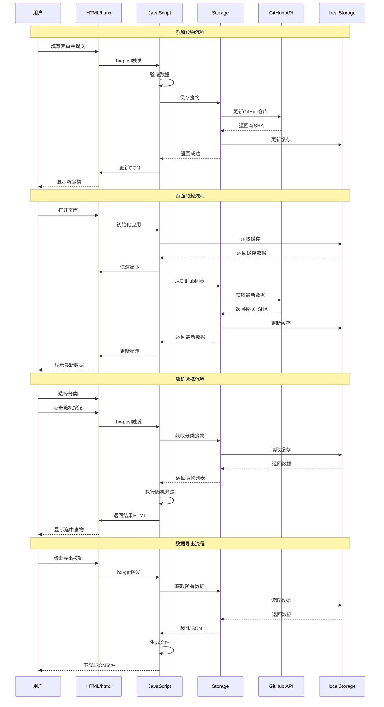

## 6. 随机选择算法流程图

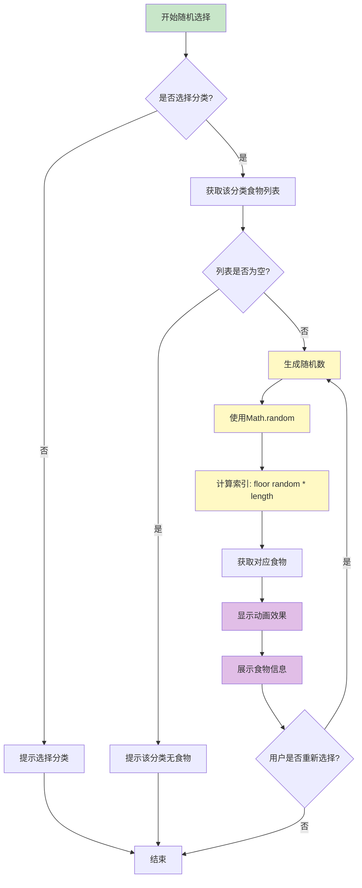

## 7. 数据存储策略图

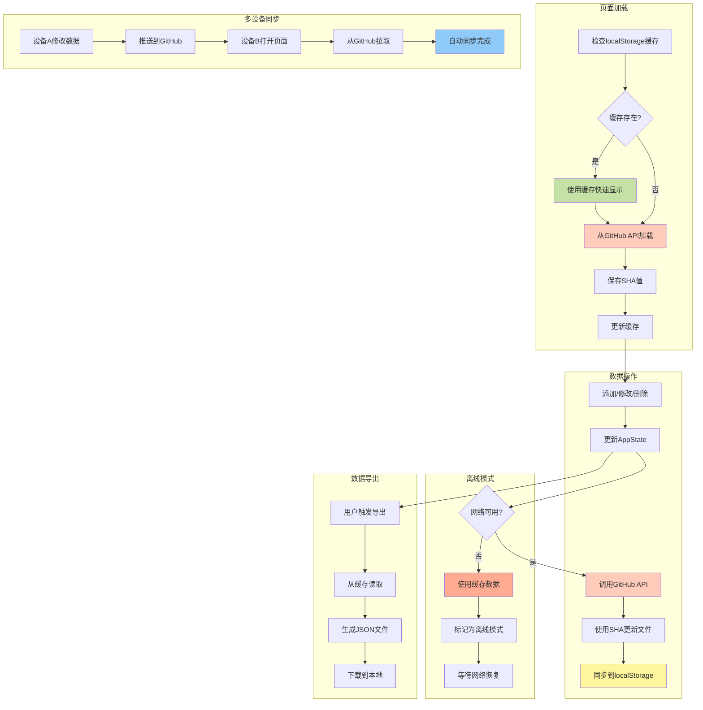

## 8. 组件层次结构图

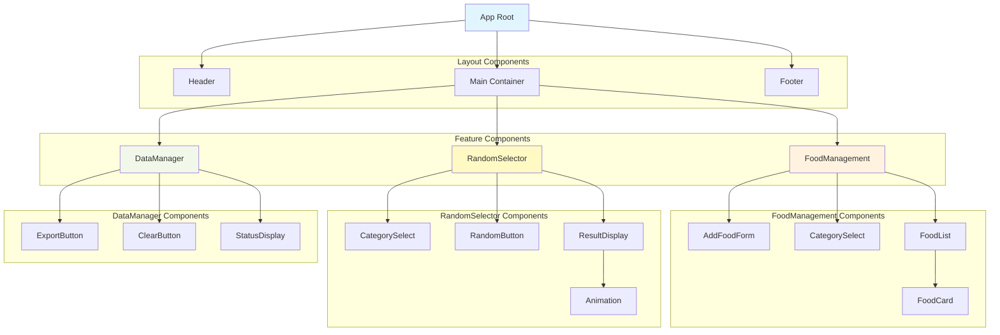

## 9. 部署流程图

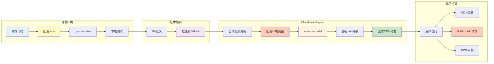

## 10. GitHub API 集成架构图

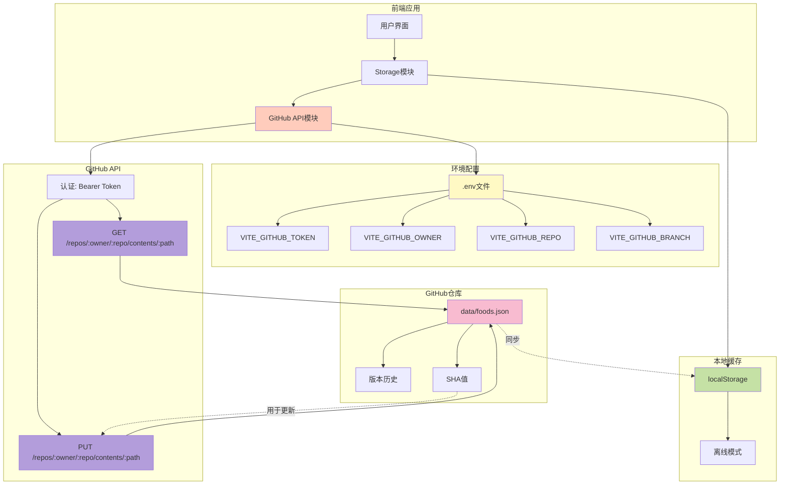

## 11. 技术栈关系图

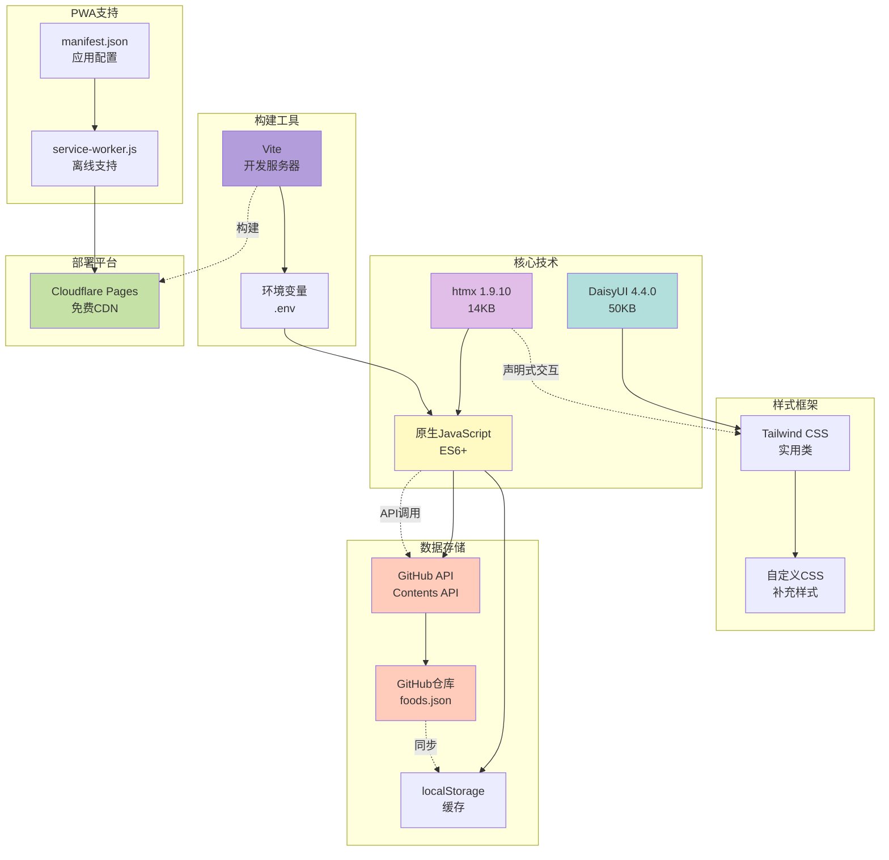

---

## 设计图说明

### 1. 系统架构图
展示了整个应用的层次结构，包括前端层、JavaScript模块、数据存储层和部署平台。

### 2. 数据流程图
描述了用户操作如何通过htmx、JavaScript处理，最终更新数据存储和UI的完整流程。

### 3. 页面结构图
展示了主页面的各个功能区域和组件的层次关系。

### 4. 数据模型关系图
使用ER图展示了食物、分类、应用状态和存储之间的关系。

### 5. 用户交互流程图
使用时序图展示了添加食物、随机选择和数据导出的完整交互流程。

### 6. 随机选择算法流程图
详细描述了随机选择功能的算法逻辑和决策流程。

### 7. 数据存储策略图
展示了基于 GitHub API 的数据加载、操作、持久化和多设备同步的完整策略。

### 8. 组件层次结构图
展示了应用的组件树结构和各组件之间的关系。

### 9. 部署流程图
描述了从开发到生产的完整部署流程，包括环境变量配置和 Vite 构建。

### 10. GitHub API 集成架构图
详细展示了如何通过 GitHub API 进行数据存储、读取和版本控制的完整架构。

### 11. 技术栈关系图
展示了各个技术组件之间的依赖和协作关系，包括 GitHub API 集成。
